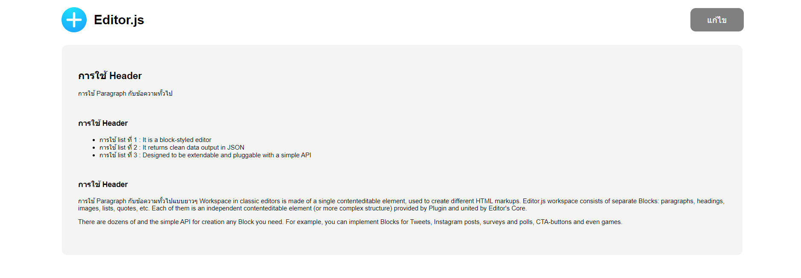

# react-editor-tools

Small projects using `React` & `Editor.js` Packages Working on docker

Demo :

---

### `git clone`

Clone project

### `docker compose up`

After clone project into your docker go to folder_project and type `docker compose up` to run project , Will be automatic start with `npm run start`

## Knowledge

[react-editorjs-example](https://codesandbox.io/s/react-editorjs-example-ng6qzo).
